# PSX Intelligence System Data Flow

Is diagram mein har major file ka role clear hai: kis file se output nikalta hai,
wo output kahan jata hai, aur next step mein kaun usay use karta hai.

```mermaid
flowchart LR
    %% -----------------------------
    %% Historical price data
    %% -----------------------------
    subgraph PRICE["Price Data Preparation"]
        P1["data_sources/psxdata_client.py<br/>downloads PSX tickers + sample OHLCV"]
        P2["data/all_tickers.csv<br/>all PSX ticker symbols"]
        P3["data/historical/*.csv<br/>per-symbol raw history"]
        P4["data/sample_psx_data.csv<br/>merged sample OHLCV"]
        P5["data_sources/clean_psx_data.py<br/>cleans sample data"]
        P6["data/processed/psx_cleaned_data.csv<br/>clean OHLCV + anomaly/source/stream_type"]

        F1["scripts/finalize_100_stocks_data.py<br/>final 100-stock data builder"]
        F2["data/metadata/all_tickers.csv<br/>all tickers metadata"]
        F3["data/metadata/filtered_common_stocks.csv<br/>common-stock symbols only"]
        F4["data/metadata/liquidity_rank.csv<br/>liquidity ranking"]
        F5["data/metadata/target_100_stocks.csv<br/>top 100 target symbols"]
        F6["data/raw/prices_daily/*.csv<br/>raw daily price files"]
        F7["data/processed/psx_prices_100_daily.csv<br/>final 100-stock price dataset"]
        F8["data/processed/psx_prices_100_quality_report.csv<br/>data quality summary"]

        P1 -->|"writes"| P2
        P1 -->|"writes"| P3
        P1 -->|"writes"| P4
        P4 -->|"input"| P5
        P5 -->|"writes"| P6

        F1 -->|"writes"| F2
        F1 -->|"writes"| F3
        F3 -->|"used inside ranking step"| F4
        F4 -->|"top N"| F5
        F5 -->|"symbols to download"| F6
        F6 -->|"merged + cleaned"| F7
        F7 -->|"summarized by"| F8
    end

    %% -----------------------------
    %% Kafka and Spark
    %% -----------------------------
    subgraph STREAM["Kafka + Spark Stream Processing"]
        K1["kafka_layer/producer.py<br/>reads cleaned CSV and sends Kafka messages"]
        K2["Kafka topic: psx-stock-prices<br/>JSON OHLCV tick messages"]
        S1["run_spark_stream.py<br/>starts Spark processor"]
        S2["spark_layer/stream_processor.py<br/>reads Kafka, parses TICK_SCHEMA"]
        S3["spark_layer/cleaning.py<br/>clean_stock_batch output"]
        S4["spark_layer/trend_detection.py<br/>adds moving average, trend, event_type"]
        S5["spark_layer/output_writer.py<br/>writes processed batch"]
        S6["data/processed/psx_trends/*<br/>trend/event rows as JSON"]
        K3["kafka_layer/consumer.py<br/>debug consumer prints Kafka messages"]

        P6 -->|"input CSV"| K1
        K1 -->|"produces"| K2
        K2 -->|"debug reads"| K3
        S1 -->|"calls main()"| S2
        K2 -->|"stream/manual poll input"| S2
        S2 -->|"batch_df"| S3
        S3 -->|"cleaned_df"| S4
        S4 -->|"trend_df"| S5
        S5 -->|"writes"| S6
    end

    %% -----------------------------
    %% News and RAG
    %% -----------------------------
    subgraph NEWS["News Collection + RAG Index"]
        N0["data/symbols_seed.csv<br/>symbol, company, sector seed list"]
        N1["rag_layer/news_collector.py<br/>Google News RSS + manual URLs collector"]
        N2["data/manual_news_urls.csv<br/>optional manual input"]
        N3["data/psx_news.csv<br/>news records with title/summary/article_text"]
        N4["rag_layer/news_loader.py<br/>cleans news and builds document_text"]
        N5["rag_layer/create_embeddings.py<br/>embeds document_text"]
        N6["data/processed/vector_index/news_index.faiss<br/>FAISS vector index"]
        N7["data/processed/vector_index/news_metadata.json<br/>news metadata for search results"]
        N8["rag_layer/vector_store.py<br/>semantic or lexical search"]
        N9["rag_layer/retriever.py<br/>company, sector, market fallback retrieval"]

        N0 -->|"symbols used by"| N1
        N2 -.->|"optional URLs"| N1
        N1 -->|"writes/merges"| N3
        N3 -->|"input CSV"| N4
        N4 -->|"DataFrame + document_text"| N5
        N5 -->|"writes"| N6
        N5 -->|"writes"| N7
        N6 -->|"loaded by"| N8
        N7 -->|"loaded by"| N8
        N8 -->|"search results"| N9
    end

    %% -----------------------------
    %% Agents and decision support
    %% -----------------------------
    subgraph AGENTS["LangGraph Agents"]
        A0["tests/test_spark_to_agents.py<br/>demo bridge reads psx_trends"]
        A1["agents/event_adapter.py<br/>market event row -> PSXAgentState"]
        A2["agents/state.py<br/>shared state fields"]
        A3["agents/graph.py<br/>news -> sentiment -> RAG -> decision"]
        A4["agents/news_agent.py<br/>uses RAGRetriever"]
        A5["sentiment_layer/sentiment_service.py<br/>news list -> aggregate sentiment"]
        A6["sentiment_layer/sentiment_model.py<br/>FinBERT text sentiment"]
        A7["agents/sentiment_agent.py<br/>stores sentiment in state"]
        A8["agents/rag_agent.py<br/>builds natural-language explanation"]
        A9["agents/decision_agent.py<br/>BUY/SELL/HOLD academic label"]
        A10["Final agent output<br/>retrieved_news, sentiment, rag_explanation, decision, confidence"]

        S6 -.->|"demo/test input"| A0
        A0 -.->|"selected trend row"| A1
        N0 -->|"company/sector lookup"| A1
        A1 -->|"initial PSXAgentState"| A3
        A2 -->|"state schema"| A3
        A3 -->|"node 1"| A4
        N9 -->|"retrieved_news"| A4
        A4 -->|"if news found"| A7
        A4 -.->|"if no news"| A8
        A7 -->|"calls"| A5
        A5 -->|"calls"| A6
        A7 -->|"sentiment fields"| A8
        A4 -->|"news context"| A8
        A8 -->|"rag_explanation"| A9
        A9 -->|"decision fields"| A10
    end

    %% -----------------------------
    %% Config and current UI status
    %% -----------------------------
    subgraph SUPPORT["Support Files"]
        C1["config/kafka_config.py<br/>KAFKA_BOOTSTRAP_SERVERS + KAFKA_TOPIC"]
        C2["DVC files<br/>track data outputs: psx_news, psx_cleaned_data, psx_trends, vector_index"]
        U1["app.py + dashboard/*<br/>currently empty/not wired into active flow"]

        C1 -->|"used by"| K1
        C1 -->|"used by"| K3
        C1 -->|"used by"| S2
        C2 -.->|"tracks"| N3
        C2 -.->|"tracks"| P6
        C2 -.->|"tracks"| S6
        C2 -.->|"tracks"| N6
        C2 -.->|"tracks"| N7
    end
```

## Quick Read

- `data/metadata/filtered_common_stocks.csv` is produced by
  `scripts/finalize_100_stocks_data.py`; it filters PSX symbols down to common
  stocks and feeds the ranking/target-stock selection step inside that script.
- `data/processed/psx_cleaned_data.csv` is the active input for
  `kafka_layer/producer.py`.
- `data/processed/psx_trends/*` is produced by Spark and currently consumed by
  `tests/test_spark_to_agents.py` as the demo bridge into agents.
- `data/psx_news.csv` becomes `vector_index/news_index.faiss` +
  `vector_index/news_metadata.json`; those are loaded by `NewsVectorStore`, used
  by `RAGRetriever`, then consumed by `NewsAgent`.
- `app.py` and `dashboard/*` are present but not connected to this flow yet.
